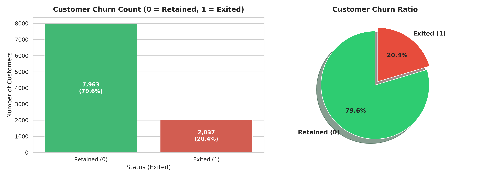
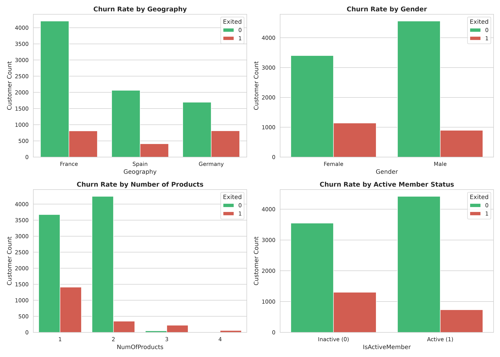
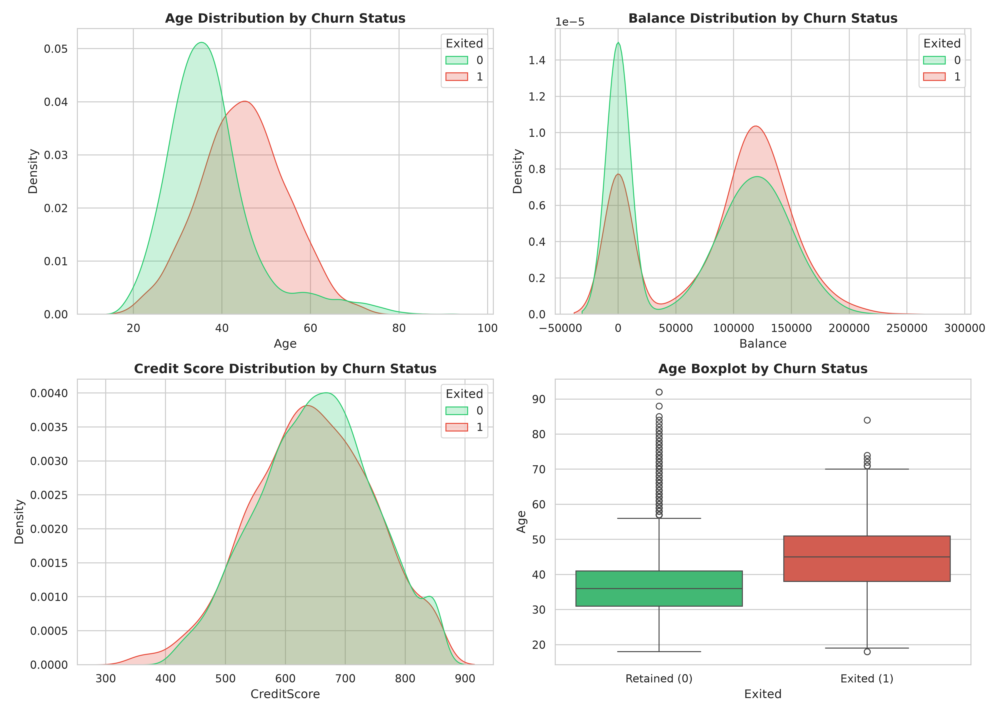
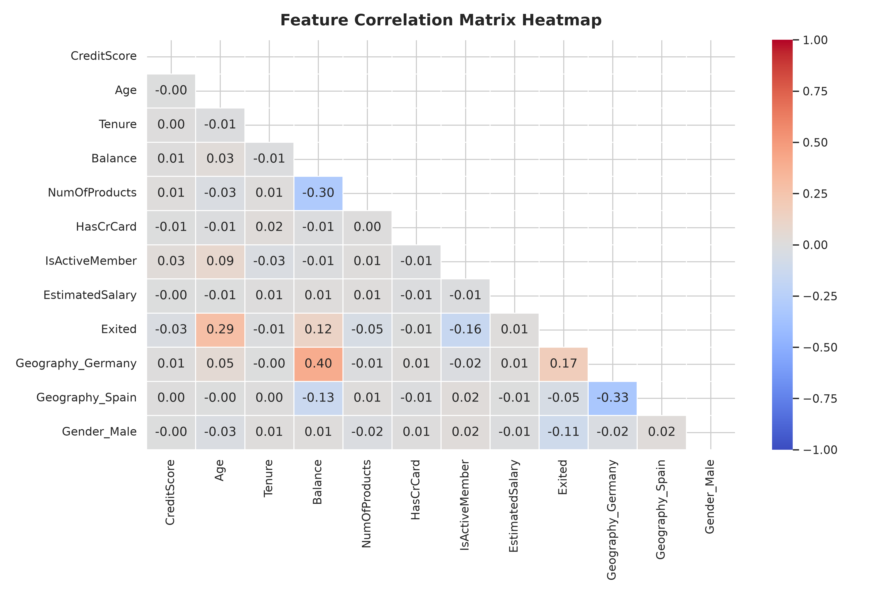
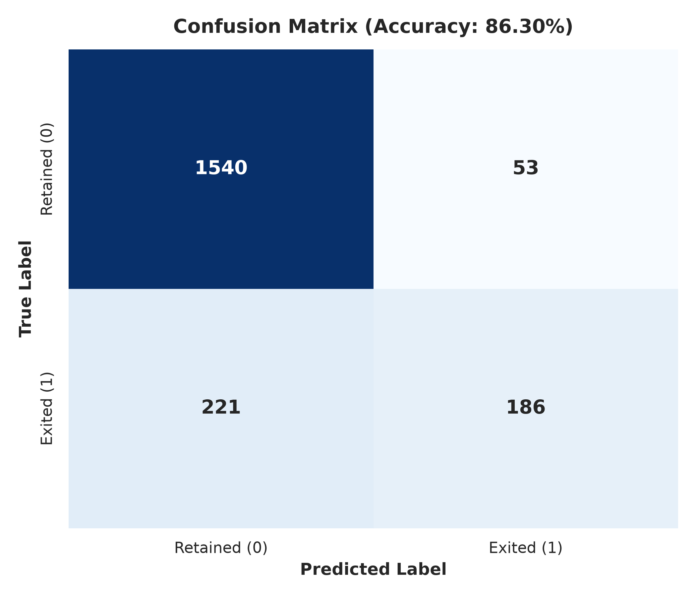
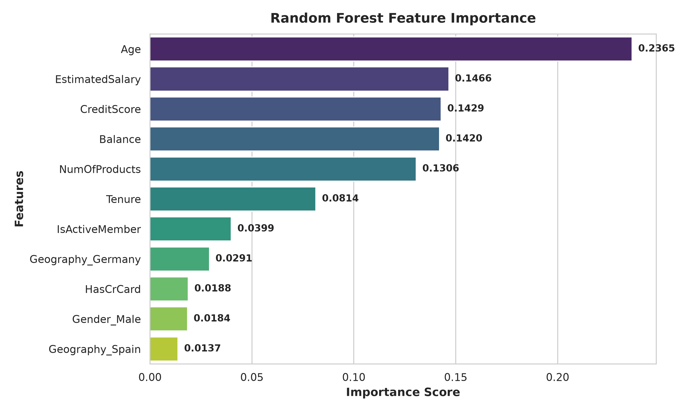

# 📊 สรุปผลการวิเคราะห์พฤติกรรมการยกเลิกบริการของลูกค้า (Bank Customer Churn Classification)

เอกสารฉบับนี้เป็นสรุปผลการวิเคราะห์สำรวจข้อมูล (**Exploratory Data Analysis - EDA**) และผลการสร้างโมเดล Machine Learning เพื่อทำนายการยกเลิกบริการของลูกค้าธนาคาร (Customer Churn) จากไฟล์ notebook [`Churn.ipynb`](file:///Users/phoom/kaggle/Churn%20Classification/Churn.ipynb)

---

## 🎯 1. สรุปภาพรวมโครงการ (Executive Summary)

* **เป้าหมาย**: ทำนายและวิเคราะห์ปัจจัยสำคัญที่มีผลต่อการยกเลิกใช้บริการของลูกค้า (`Exited`) เพื่อหาแนวทางในการรักษาฐานลูกค้า (Customer Retention)
* **ชุดข้อมูล**: `ChurnModelling.csv` จำนวน **10,000 รายการ** รวม **14 คอลัมน์**
* **โมเดลที่ใช้**: **Random Forest Classifier** (100 Trees)
* **ผลประสิทธิภาพ**:
  * **ความแม่นยำ (Accuracy)**: **86.30%**
  * **Precision (Class 1 - Churn)**: **78.48%**
  * **Recall (Class 1 - Churn)**: **45.70%**
  * **F1-Score (Class 1 - Churn)**: **57.76%**

---

## 📈 2. การวิเคราะห์สำรวจข้อมูลเชิงลึกด้วย Seaborn (EDA Graphs)

### 2.1 สัดส่วนการยกเลิกบริการ (Target Distribution)
จากการตรวจสอบพฤติกรรมการใช้งาน พบว่ามีสัดส่วนลูกค้าที่ยกเลิกบริการ (Exited = 1) คิดเป็น **20.4%** (2,037 ราย) ขณะที่ลูกค้าที่ยังคงใช้งานอยู่ (Retained = 0) มีสัดส่วน **79.6%** (7,963 ราย)

---

### 2.2 อัตราการยกเลิกบริการจำแนกตามปัจจัยหมวดหมู่ (Categorical Analysis)
การวิเคราะห์ความสัมพันธ์ระหว่างตัวแปรหมวดหมู่กับอัตราการยกเลิกบริการ เผยให้เห็นข้อค้นพบสำคัญดังนี้:

* 🇩🇪 **Geography**: ลูกค้าใน **ประเทศเยอรมนี (Germany)** มีอัตราการยกเลิกบริการสูงกว่าฝรั่งเศสและสเปนเกือบ **2 เท่า** (ประมาณ 32% vs 16%)
* 👩‍💼 **Gender**: เพศหญิง (**Female**) มีอัตราการลาออกสูงกว่าเพศชายอย่างเห็นได้ชัด
* 📦 **NumOfProducts**: ลูกค้าที่มี **2 ผลิตภัณฑ์** มีอัตราการยกเลิกบริการต่ำที่สุด (ประมาณ 7.6%) ในขณะที่ลูกค้าที่มี 3 หรือ 4 ผลิตภัณฑ์ มีอัตราการยกเลิกบริการสูงมาก (แทบจะ 100% สำหรับ 4 ผลิตภัณฑ์)
* ⚡ **IsActiveMember**: ลูกค้าที่มีสถานะ **Inactive (ไม่ใช้งานสม่ำเสมอ)** มีโอกาสยกเลิกบริการสูงกว่ากลุ่มที่ Active อย่างชัดเจน

---

### 2.3 การกระจายตัวของข้อมูลเชิงตัวเลข (Numerical Features Distribution)
เปรียบเทียบการกระจายตัวของคุณลักษณะเชิงตัวเลขระหว่างกลุ่มลูกค้าที่คงอยู่และยกเลิกบริการ:

* ⏳ **Age (อายุ)**: กลุ่มลูกค้าที่ยกเลิกบริการมีอายุเฉลี่ยสูงกว่า (ช่วงอายุ 40-60 ปี) ขณะที่กลุ่มที่ยังคงใช้อยู่มีอายุเฉลี่ยประมาณ 30-40 ปี
* 💳 **Balance (ยอดเงินคงเหลือ)**: ลูกค้าที่มียอดเงินในบัญชีสูงกลับพบสัดส่วนการยกเลิกบริการมากกว่ากลุ่มที่มียอดเงินน้อยหรือเป็นศูนย์

---

### 2.4 เมทริกซ์ความสัมพันธ์ของตัวแปร (Correlation Heatmap)
การวิเคราะห์ความสัมพันธ์ระหว่างตัวแปร (Feature Correlation) ด้วย Seaborn Heatmap:

* ตัวแปรที่มีความสัมพันธ์เชิงบวกกับการยกเลิกบริการ (`Exited`) มากที่สุด ได้แก่ **`Age` (0.29)**, **`Geography_Germany` (0.17)**, และ **`Balance` (0.12)**
* ตัวแปรที่มีความสัมพันธ์เชิงลบ ได้แก่ **`IsActiveMember` (-0.16)** และ **`Gender_Male` (-0.11)**

---

## 🤖 3. ประสิทธิภาพของโมเดล และ ความสำคัญของตัวแปร (Model Performance)

### 3.1 Confusion Matrix (ผลการทดสอบกับ Test Set 2,000 รายการ)

| Actual \ Predicted | Retained (0) | Exited (1) | Total |
| :--- | :---: | :---: | :---: |
| **Retained (0)** | **1,540** (TN) | 53 (FP) | 1,593 |
| **Exited (1)** | 221 (FN) | **186** (TP) | 407 |

---

### 3.2 ความสำคัญของตัวแปรในการทำนาย (Random Forest Feature Importance)
จากการประเมินด้วย Random Forest เผยให้เห็นปัจจัย 5 อันดับแรกที่มีอิทธิพลต่อการทำนายมากที่สุด:

1. **Age (อายุ)** - 23.94%
2. **EstimatedSalary (ประมาณการเงินเดือน)** - 14.61%
3. **CreditScore (คะแนนเครดิต)** - 14.34%
4. **Balance (ยอดเงินในบัญชี)** - 14.24%
5. **NumOfProducts (จำนวนผลิตภัณฑ์)** - 12.87%

---

## 💡 4. คำแนะนำเชิงธุรกิจ (Business Recommendations)

1. 🎯 **มุ่งเน้นการดูแลลูกค้ารุ่นใหญ่ (Age 40-60)**:
   * จัดทำแพ็กเกจการลงทุน สิทธิประโยชน์หลังเกษียณ หรือบริการที่ปรึกษาทางการเงินระดับ VIP เพื่อเพิ่มความจงรักภักดีในกลุ่มลูกค้ารุ่นใหญ่
2. 🇩🇪 **ปรับปรุงบริการและแก้ไขปัญหาสาขาเยอรมนี**:
   * ตรวจสอบสาเหตุเชิงลึกว่าทำไมลูกค้าในประเทศเยอรมนีจึงย้ายออกสูงเป็นพิเศษ เช่น ค่าธรรมเนียม หรือบริการที่ไม่ตรงใจ
3. 🛍️ **ส่งเสริมการถือครอง 2 ผลิตภัณฑ์ (Optimal Product Strategy)**:
   * สนับสนุนให้ลูกค้าที่ถือ 1 ผลิตภัณฑ์ขยับมาถือ 2 ผลิตภัณฑ์ ( Cross-selling ) แต่ควรหลีกเลี่ยงการยัดเยียดผลิตภัณฑ์เกิน 2 ชนิดเนื่องจากพบอัตราการลาออกสูงขึ้น
4. 🔄 **กระตุ้นกิจกรรมลูกค้ากลุ่ม Inactive**:
   * ออกแคมเปญการตลาดเพื่อกระตุ้นให้ลูกค้าที่ไม่ค่อยเคลื่อนไหวกลับมาใช้งานสม่ำเสมอ เช่น การให้แต้มสะสม หรือส่วนลดพิเศษเมื่อใช้งานแอปพลิเคชัน

---

## 📁 โครงสร้างไฟล์ในโครงการ

* [`Churn.ipynb`](file:///Users/phoom/kaggle/Churn%20Classification/Churn.ipynb): Jupyter Notebook สำหรับการทำ EDA, สร้างกราฟ Seaborn และฝึกสอนโมเดล Machine Learning
* [`ChurnModelling.csv`](file:///Users/phoom/kaggle/Churn%20Classification/ChurnModelling.csv): Dataset ข้อมูลลูกค้า 10,000 รายการ
* [`images/`](file:///Users/phoom/kaggle/Churn%20Classification/images): โฟลเดอร์เก็บรูปภาพกราฟวิเคราะห์ทั้งหมด
* [`SUMMARY.md`](file:///Users/phoom/kaggle/Churn%20Classification/SUMMARY.md): เอกสารสรุปผลการวิเคราะห์ฉบับสมบูรณ์
